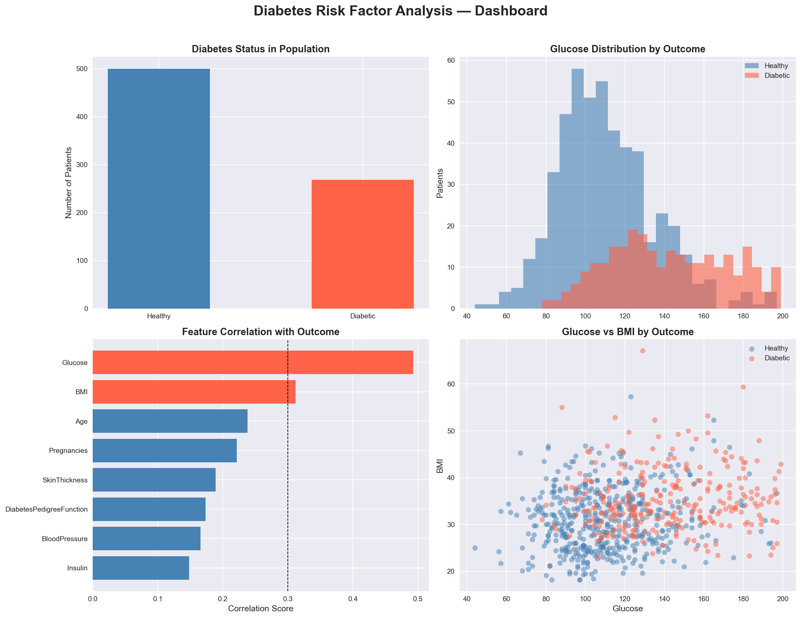
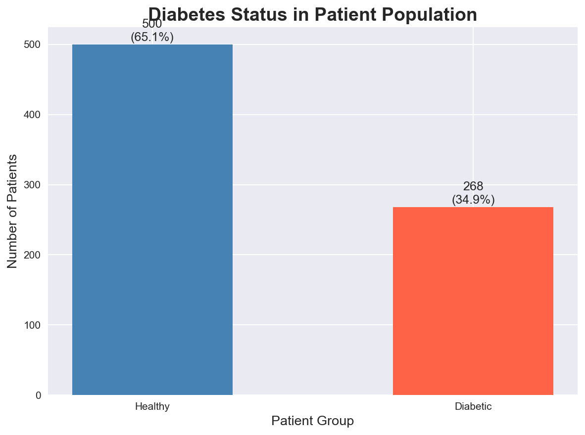
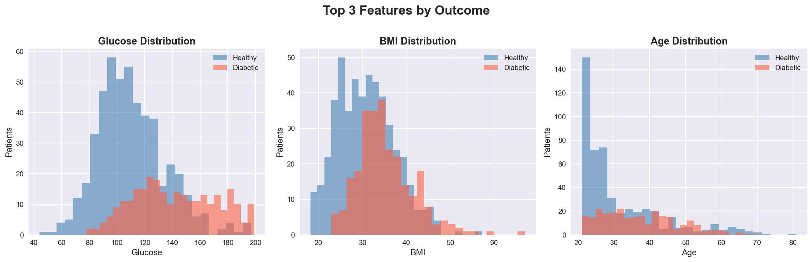
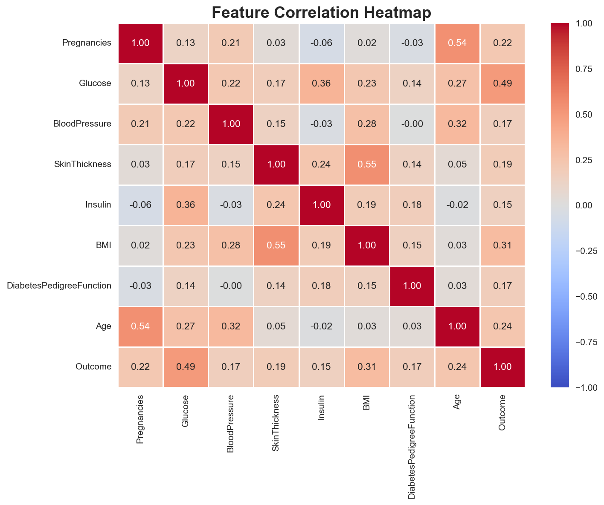
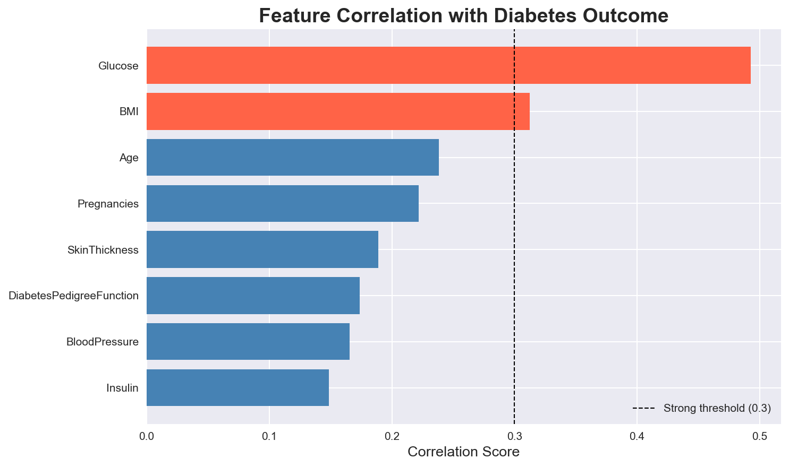

# 🏥 Diabetes Risk Factor Analysis
### Exploratory Data Analysis on the Pima Indians Diabetes Dataset


---

## 📌 Project Overview

This project analyses a real clinical dataset collected by the **National Institute of Diabetes
and Digestive and Kidney Diseases (NIDDK)** to identify patterns and risk factors associated
with Type 2 diabetes in female patients of Pima Indian heritage.

The goal is not to build a machine learning model — but to deeply understand the data through
cleaning, exploration, and statistical analysis, and communicate findings through clear visuals.

---

## ❓ The Core Question

> *"What factors most strongly predict whether a patient has diabetes —
> and what patterns exist across the patient population?"*

---

## 📈 Dashboard



---

## 📂 Project Structure

```
healthcare-analysis/
│
├── data/
│   ├── diabetes.csv                    # Raw dataset (never modified)
│   └── diabetes_cleaned.csv           # Cleaned dataset
│
├── notebooks/
│   ├── 01_data_cleaning.ipynb         # Load, inspect, fix data quality issues
│   ├── 02_eda.ipynb                   # Exploratory analysis & questions
│   ├── 03_statistical_analysis.ipynb  # Correlations & comparisons
│   └── 04_visualizations.ipynb       # Final publication-quality charts
│
├── outputs/
│   └── charts/                        # Saved PNG plot files
│
├── requirements.txt                   # Python dependencies
└── README.md                          # This file
```

---

## 📊 Dataset

| Property      | Details                                              |
|---------------|------------------------------------------------------|
| Source        | National Institute of Diabetes and Digestive and Kidney Diseases (NIDDK) |
| Available at  | [Kaggle](https://www.kaggle.com/datasets/uciml/pima-indians-diabetes-database) |
| Patients      | 768 female patients, aged 21 and above               |
| Features      | 8 medical attributes + 1 target column               |
| Target        | `Outcome` — 1 = Diabetic, 0 = Not Diabetic           |

**Features:** Pregnancies, Glucose, BloodPressure, SkinThickness, Insulin, BMI,
DiabetesPedigreeFunction, Age

---

## 🔧 What I Did

### 1. Data Cleaning
- Found invalid zeros in 5 columns (Glucose, BloodPressure, SkinThickness, Insulin, BMI)
- Insulin had the most — 374 zeros (48.7% of the dataset)
- BloodPressure had 35 zeros (4.6%) — medically impossible values
- Replaced all invalid zeros with column medians to preserve data integrity
- Saved cleaned dataset to `data/diabetes_cleaned.csv`

### 2. Exploratory Data Analysis
- Dataset is imbalanced — 500 healthy patients (65.1%) vs 268 diabetic patients (34.9%)
- Diabetic patients had a significantly higher average glucose (142.13) vs healthy patients (110.68)
- Diabetic patients tend to be older — average age 37.07 vs 31.19 for healthy patients
- Diabetic patients have higher average BMI (35.38) vs healthy patients (30.88)
- Scatter plots showed diabetic patients clustering in the high glucose + older age region

### 3. Statistical Analysis
- Glucose had the strongest correlation with diabetes outcome (r = 0.49)
- BMI was the second strongest predictor (r = 0.31)
- Age was third (r = 0.24)
- Insulin results are less reliable due to 48.7% of values being replaced during cleaning
- Box plots confirmed Glucose shows the clearest separation between diabetic and healthy groups

### 4. Key Visualisations
- Outcome distribution bar chart with percentage labels
- Overlapping histograms for Glucose, BMI and Age by outcome
- Correlation heatmap showing relationships between all features
- Feature importance horizontal bar chart ranked by correlation strength
- Full dashboard combining all 4 key charts into one figure

---

## 💡 Key Findings

- 🔍 **Glucose is the strongest predictor** — diabetic patients had 31 points higher average glucose than healthy patients (142 vs 111)
- 🔍 **Almost half of Insulin values were missing** — 374 out of 768 records had impossible zero values, making it the dirtiest column in the dataset
- 🔍 **Age + high glucose is a dangerous combination** — scatter plots show older patients with high glucose are almost exclusively diabetic
- 🔍 **The dataset is imbalanced** — only 1 in 3 patients is diabetic, which must be considered in any further modelling
- 🔍 **BMI and Glucose together** show the clearest clustering of diabetic patients in the high-risk zone

---

## 📊 Sample Visualisations

### Outcome Distribution


### Feature Distributions by Outcome


### Correlation Heatmap


### Feature Importance


---

## 🚀 How to Run

1. **Clone the repository**
```bash
git clone https://github.com/tarun132006/healthcare-analysis.git
cd healthcare-analysis
```

2. **Install dependencies**
```bash
pip install -r requirements.txt
```

3. **Download the dataset**
   - Go to [Kaggle](https://www.kaggle.com/datasets/uciml/pima-indians-diabetes-database)
   - Download `diabetes.csv`
   - Place it inside the `data/` folder

4. **Run the notebooks in order**
```
01_data_cleaning.ipynb  →  02_eda.ipynb  →  03_statistical_analysis.ipynb  →  04_visualizations.ipynb
```

---

## 🛠️ Requirements

```
numpy==2.4.6
pandas==3.0.3
matplotlib==3.10.9
seaborn==0.13.2
jupyter
ipykernel
```

---

## 👤 Author

**Tarun**
- GitHub: [@tarun132006](https://github.com/tarun132006)

---

## 📜 License

This project is open source and available under the [MIT License](LICENSE).

---

*Dataset originally collected by the NIDDK and made available via the
UCI Machine Learning Repository.*